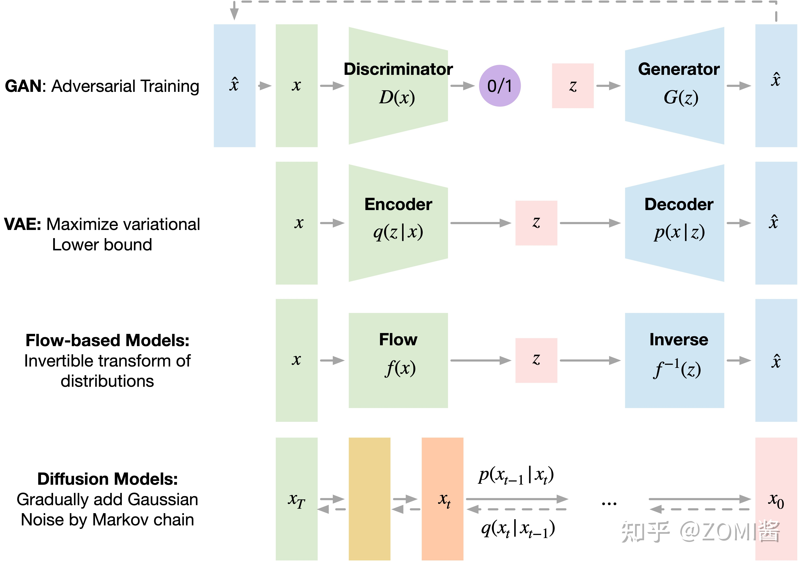
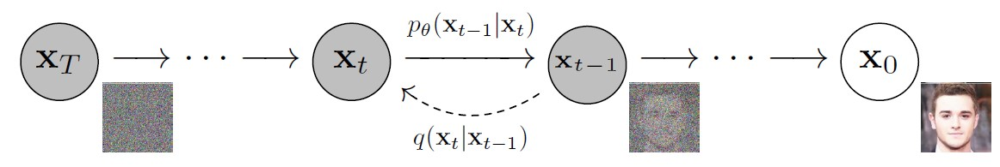

# Diffusion

常见的生成模型包含[GAN](http://papers.nips.cc/paper/5423-generative-adversarial-nets.pdf)、[VAE](https://arxiv.org/abs/1312.6114)、[Flow Models](https://proceedings.mlr.press/v97/ho19a.html)等等, 所谓生成模型, 就是给一组随机噪声, 通过某种概率模型下的变换, 输出一些具有一定语义信息的数据(比如图像、文本等)。Diffusion Model也是一种生成模型, 2020年[DDPM](https://hojonathanho.github.io/diffusion/)的发表使得图像生成领域的很多工作都开始转向Diffusion Model。

## 生成模型对比

 

### GAN

**生成对抗网络**是一种基于深度学习的生成模型，能够生成新内容。GAN采用监督学习方法，使用两个子模型: 从问题域生成新数据的**生成器模型**和将数据分类为真实的(来自领域)或假的(生成的)的**鉴别器模型**。这两个模型作为竞争对手进行训练。生成器直接产生样本数据，它的对手鉴别器则试图区分从训练数据中提取的样本和从生成器中提取的样本。这个竞争过程在训练中持续进行，直到鉴别器模型有一半以上的时间无法判断真假，这意味着生成器模型正在生成非常逼真的数据。

但是这里每个模型都可以压倒另一个: 如果鉴别器太好，它将返回非常接近0或1的值，生成器则难以获得更新的梯度; 如果生成器太好，它就会利用鉴别器的弱点导致漏报。所以这两个神经网络必须具有通过各自的学习速率达到的相似的“技能水平”，这也是我们常说的GAN难以训练的原因之一。

### VAE

**变分自编码器**是一种生成模型，它“提供潜在空间中观察结果的概率描述”。简单地说，这意味着VAE将潜在属性存储为概率分布。标准的自动编码器包括2个相似的网络，一个**编码器**和一个**解码器**。编码器接受输入并将其转换为更小的表示形式，解码器可以使用该表示形式将其转换回原始输入。变分自编码器具有连续的潜在空间，这样可以使随机采样和插值更加方便。为了实现这一点，编码器的隐藏节点不输出编码向量，而是输出两个大小相同的向量: 一个**均值向量**和一个**标准差向量**。每一个隐藏的节点都认为自己是高斯分布的。我们从编码器的输出向量中采样送入解码器, 这个过程就是随机生成。这意味着即使对于相同的输入，当平均值和标准差保持不变时，实际的编码在每一次传递中都会有所不同。

训练过程是最小化**重构损失**(输出与输入的相似程度)和**潜在损失**(隐藏节点与正态分布的接近程度)。潜在损失越小，可以编码的信息就越少，这样重构损失就会增加，所以在潜在损失和重建损失之间是需要进行进行权衡的。当潜在损耗较小时，生成的图像与训练的的图像会过于相似，效果较差。在重构损失小的情况下，训练时的重构图像效果较好，但生成的新图像与重构图像相差较大，所以需要找到一个好的平衡。

VAE的一个主要缺点是它们生成的输出模糊, 这是由数据分布恢复和损失函数计算的方式造成的。

### Flow Model

**基于流的生成模型**是精确的对数似然模型，它将一堆**可逆变换**应用于来自先验的样本，以便可以计算观察的精确对数似然。与前两种算法不同，该模型显式地学习数据分布，因此损失函数是负对数似然。流模型 $f$ 被构造为一个将高维随机变量 $x$ 映射到标准高斯潜变量 $z$ 的**可逆变换**, 它可以是任意的双射函数，并且可以通过叠加各个简单的可逆变换来形成。

流模型可逆但计算效率并不高，基于流的模型生成相同分辨率的图像所需时间是GAN的几倍。

### Diffusion Model

Diffusion Model的灵感来自 *non-equilibrium thermodynamics (非平衡热力学)*, 理论首先定义扩散步骤的马尔可夫链，缓慢地将随机噪声添加到数据中，然后学习逆向扩散过程以从噪声中构造所需的数据样本。与VAE或流模型不同，扩散模型是通过固定过程学习，并且隐空间具有比较高的维度。

## 扩散模型

扩散模型(Diffusion Model)用于生成与训练数据相似的数据。从根本上说，Diffusion Model的工作原理是通过连续添加**高斯噪声**来破坏训练数据，然后通过学习反转的去噪过程来恢复数据。训练后，我们可以使用 Diffusion Model将随机采样的噪声传入模型中，通过学到的去噪过程来生成数据。

更具体地说，扩散模型是一种隐变量模型(latent variable model)，使用马尔可夫链(Markov Chain)映射到隐空间(latent space)。通过马尔科夫链，在每一个时间步 $t$ 中逐渐将噪声添加到数据 $x_i$ 中。Diffusion Model分为正向的扩散过程和反向的逆扩散过程。

### Forward

所谓前向过程，即往图片上加噪声的过程。给定图片 $x_0$ , 前向过程通过 $T$ 次累计对其添加高斯噪声，得到 $x_1, x_2, \cdots, x_T$ . 前向过程每个时刻 $t$ 只与 $t-1$ 时刻有关，所以可以看做**马尔科夫过程**, 其数学形式可以写成:

$$q(x_t|x_{t-1}) = \mathcal{N}(x_t; \sqrt{1-\beta_t}x_{t-1}, \beta_t\mathbf{I})$$

$$q(x_{1:T}|x_0) = \prod_{t=1}^{T}{q(x_t|x_{t-1})} = \prod_{t=1}^{T}{\mathcal{N}(x_t; \sqrt{1-\beta_t}x_{t-1}, \beta_t\mathbf{I})}$$

其中 $\beta_1, \cdots, \beta_T$ 是高斯分布方差的超参数, 一般设置为是由 $0.0001$ 到 $0.02$ 线性插值。在扩散过程中，随着 $t$ 的增大, $x_t$ 越来越接近纯噪声。当 $T$ 足够大的时候，收敛为标准高斯噪声 $\mathcal{N}(0, \mathbf{I})$ 。

能够通过 $x_0$ 和 $\beta$ 快速得到 $x_t$ 对后续diffusion model的推断有巨大作用。首先我们假设 $\alpha_t = 1 - \beta_t$ ，并且 $\overline{\alpha_t} = \prod_{i=1}^{t}{\alpha_i}$ ，展开 $x_t$ 可以得到:

$$ x_t = \sqrt{\alpha_t}x_{t-1} + \sqrt{1-\alpha_t}\epsilon_1 = \sqrt{\alpha_t}(\sqrt{\alpha_{t-1}}x_{t-2} + \sqrt{1-\alpha_{t-1}}\epsilon_2) + \sqrt{1-\alpha_t}\epsilon_1 = \sqrt{\alpha_t\alpha_{t-1}}x_{t-2} + (\sqrt{\alpha_t(1-\alpha_{t-1})}\epsilon_2 + \sqrt{1-\alpha_t}\epsilon_1)$$ 

其中 $\epsilon_1, \epsilon_2 \sim \mathcal{N}(0, \mathbf{I})$, 根据正态分布的性质, 即 $\mathcal{N}(0, \sigma_1^2\mathbf{I}) + \mathcal{N}(0, \sigma_2^2\mathbf{I}) \sim \mathcal{N}(0, (\sigma_1^2+\sigma_2^2)\mathbf{I})$ 可以得到:

$$ x_t = \sqrt{\alpha_t\alpha_{t-1}}x_{t-2} + \sqrt{1-\alpha_t\alpha_{t-1}}\overline{\epsilon_2} \qquad (\overline{\epsilon_2} \sim \mathcal{N}(0, \mathbf{I}))$$ 

依次展开, 可以得到:

$$ x_t = \sqrt{\overline{\alpha_t}}\ x_0 + \sqrt{1-\overline{\alpha_t}}\ \overline{\epsilon_t} \qquad (\overline{\epsilon_t} \sim \mathcal{N}(0, \mathbf{I}))$$ 

因此，任意时刻 $x_t$ 满足 $q(x_t | x_0) = \mathcal{N}(x_t; \sqrt{\overline{\alpha_t}}x_0, (1-\overline{\alpha_t})\mathbf{I})$.

### Reverse

如果说前向过程(forward)是**加噪**的过程，那么逆向过程(reverse)就是diffusion的**去噪**推断过程。如果我们能够逐步得到逆转后的分布 $q(x_{t-1}|x_t)$，就可以从完全的标准高斯分布 $\mathcal{N}(0, \mathbf{I})$ 还原出原图分布 $x_0$. 

 

但实际上 $q(x_{t-1}|x_t)$ 难以显示地求解，因此我们可以利用神经网络来学习这一分布 $p_\theta(x_{t-1}|x_t)$ , 其中 $\theta$ 是神经网络的超参。

$$p_\theta(x_{t-1}|x_t) = \mathcal{N}(x_{t-1}; \mu_\theta(x_t, t), \Sigma_\theta(x_t, t))$$

$$p_\theta(x_{0:T}) = p(x_T)\prod_{t=T}^{1}{p_\theta(x_{t-1}|x_t)} = p(x_T)\prod_{t=T}^{1}{\mathcal{N}(x_{t-1}; \mu_\theta(x_t, t), \Sigma_\theta(x_t, t))}$$

训练过程就是学习上面公式中的 $\mu_\theta(x_t, t)$ 和 $\Sigma_\theta(x_t, t)$ . 虽然我们无法得到逆转分布 $q(x_{t-1}|x_t)$ , 但是在训练过程中给定 $x_0$ , 我们可以利用贝叶斯公式求解 $q(x_{t-1}|x_t, x_0)$.

$$q(x_{t-1}|x_t, x_0) = q(x_t|x_{t-1}, x_0)\frac{q(x_{t-1}|x_0)}{q({x_t|x_0})} = q(x_t|x_{t-1})\frac{q(x_{t-1}|x_0)}{q({x_t|x_0})}$$

这样就将后验概率转化为了已知的先验概率，代入前面推导的公式:

$$q(x_t|x_{t-1}) \propto \exp{\left(-\frac{(x_t-\sqrt{\alpha_t}x_{t-1})^2}{2(1-\alpha_t)}\right)}$$

$$q(x_{t-1}|x_0) \propto \exp{\left(-\frac{(x_{t-1}-\sqrt{\overline{\alpha_{t-1}}}x_0)^2}{2(1-\overline{\alpha_{t-1}})}\right)}$$

$$q(x_t|x_0) \propto \exp{\left(-\frac{(x_t-\sqrt{\overline{\alpha_t}}x_0)^2}{2(1-\overline{\alpha_t})}\right)}$$

整理可以得到:

$$q(x_{t-1}|x_t, x_0) \sim \mathcal{N}(x_{t-1};\tilde{\mu_t}(x_t), \tilde{\beta_t}\mathbf{I})$$

其中:

$$\tilde{\mu_t}(x_t) = \frac{1}{\sqrt{\alpha_t}}(x_t - \frac{\beta_t}{\sqrt{1-\overline{\alpha_t}}}\overline{\epsilon_t})$$

$$\tilde{\beta_t} = \frac{1-\overline{\alpha_{t-1}}}{1-\overline{\alpha_t}}\beta_t \approx \beta_t$$

以上推导的 $\tilde{\mu_t}(x_t)$ 可视为`ground truth`，而我们将通过神经网络学习到 $\mu_\theta(x_t, t)$ , 本质上也就是学习噪声 $\epsilon_\theta(x_t, t)$:

$$\mu_\theta(x_t, t) = \frac{1}{\sqrt{\alpha_t}}(x_t - \frac{\beta_t}{\sqrt{1-\overline{\alpha_t}}}\epsilon_\theta(x_t, t))$$

### Train

训练过程就是学习上面公式中的 $\mu_\theta(x_t, t)$ 和 $\Sigma_\theta(x_t, t)$ , 进一步也就是学习噪声 $\epsilon_\theta(x_t, t)$. Diffusion使用极大似然估计来找到逆扩散过程中马尔科夫链转换的概率分布。

$$\mathcal{L} = \mathbb{E}_{q(x_0)}[-\log p_\theta(x_0)]$$

求模型的极大似然估计，等同于求解最小化负对数似然的变分上限 $\mathcal{L}_{vlb}$:

$$\mathcal{L} = \mathbb{E}_{q(x_0)}[-\log p_\theta(x_0)] \leq \mathbb{E}_{q(x_{0\ :\ T})}\left[\log\frac{q(x_{1:T}|x_0)}{p_\theta(x_{0:T})}\right] := \mathcal{L}_{vlb}$$

进一步表示为KL散度(`KL散度是一种不对称统计距离度量，用于衡量一个概率分布P与另外一个概率分布Q的差异程度`):

$$\mathcal{L}_{vlb} = \mathbb{E}_{q(x_{0\ :\ T})}\left[\log\frac{q(x_{1:T}|x_0)}{p_\theta(x_{0:T})}\right]$$

$$\qquad\qquad\qquad\quad\ \ \  = \mathbb{E}_{q(x_{0\ :\ T})}\left[\log\frac{\prod_{t=1}^{T}{q(x_t|x_{t-1})}}{p_\theta(x_T)\prod_{t=1}^{T}{p_\theta(x_{t-1}|x_t)}}\right]$$

$$\qquad\qquad\qquad\qquad\quad  = \mathbb{E}_{q(x_{0\ :\ T})}\left[-\log p_\theta(x_T) + \sum_{t=1}^{T}{\frac{q(x_t|x_{t-1})}{p_\theta(x_{t-1}|x_t)}}\right]$$

### Sample

## Reference

- [Diffusion Models：生成扩散模型](https://zhuanlan.zhihu.com/p/549623622)
- [由浅入深了解Diffusion Model](https://zhuanlan.zhihu.com/p/525106459)
- [生成扩散模型(一): 基础 (Generative Diffusion Model: Basic)](https://www.jarvis73.com/2022/08/08/Diffusion-Model-1/)