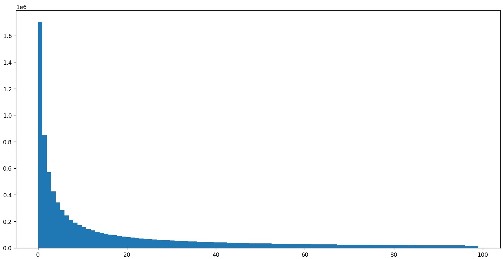

# Experiment for Paper *OneSparse*

- [Experiment for Paper *OneSparse*](#experiment-for-paper-onesparse)
  - [Get Data](#get-data)
    - [inner product -\> l2 norm](#inner-product---l2-norm)
  - [Run Elasticsearch](#run-elasticsearch)
    - [docker安装](#docker安装)
    - [demo](#demo)
    - [build index](#build-index)
    - [search](#search)
    - [utils](#utils)
  - [Run SPANN](#run-spann)
    - [install](#install)
    - [build index](#build-index-1)
    - [search](#search-1)
  - [Evaluation](#evaluation)
  - [Filter Search](#filter-search)
  - [Update Performance](#update-performance)
    - [preparation](#preparation)
    - [Run SPFresh](#run-spfresh)
    - [Run with rebuild method](#run-with-rebuild-method)

## Get Data

下载并解压[MS Marco Passages](https://microsoft.github.io/msmarco/TREC-Deep-Learning-2019.html)数据集:

```bash
mkdir data
cd data
wget https://msmarco.blob.core.windows.net/msmarcoranking/collectionandqueries.tar.gz
tar -zvxf collectionandqueries.tar.gz
```

我们只需要使用其中的三个文件:
- `collection.tsv`: 8,841,823 passages, 每一行是一篇passage, 格式为`pid \t passage`, `pid`从0开始，有序排列。
- `queries.dev.small.tsv`: 6,980 queries, 每一行是一个query, 格式为`qid \t query`, 无序排列。
- `qrels.dev.small.tsv`: query results.

读取`tsv`文件的代码如下:

```python
import csv

with open("xxx.tsv", "r", encoding="utf8") as f:
    reader = csv.reader(f, delimiter="\t")
    for row in reader:
        ...
```

接下来需要获取embedding数据, 可以用`scp`传输到服务器上。embedding数据包含两部分:

- `corpus`: 均匀拆分成了10份, 从`split00.pt`到`split09.pt`, 格式为`[embedding_matrix, pid_list]`, embedding用ar2g生成, 原来是`768维, inner product`, 变换为`769维, L2 norm`.
- `query`: 格式同上, `embedding_matrix`是6980*769的矩阵。

读取`pt`文件的代码如下:

```python
import pickle

with open("xxx.pt", 'rb') as f:
    embeddings, ids = pickle.load(f)
    # embeddings[0].tolist() 第一个embedding
    # int(ids[0]) 第一个id
```

### inner product -> l2 norm

inner product不满足三角不等式, 在query时可能会出现奇怪情况, [这篇文章](https://github.com/facebookresearch/faiss/wiki/MetricType-and-distances#how-can-i-do-max-inner-product-search-on-indexes-that-support-only-l2)提到了一种通过将embedding添加一维的方法, 将inner product转换为l2 norm.

```python
# for corpus embeddings
def transform(x): 
    '''
      x:      np.array, shape=(8841823, 768)
      output: np.array, shape=(8841823, 769)
    '''
    norms = np.linalg.norm(x, axis=1)**2
    phi = norms.max()
    extracol = np.sqrt(phi - norms)
    return np.hstack((extracol.reshape(-1, 1), x)).astype(np.float32)

# for query embeddings
def transform(x): 
    '''
      x:      np.array, shape=(6980, 768)
      output: np.array, shape=(6980, 769)
    '''
    extracol = np.zeros(x.shape[0]).astype(np.float32)
    return np.hstack((extracol.reshape(-1, 1), x)).astype(np.float32)
```

## Run Elasticsearch

官方文档:

- [create index](https://www.elastic.co/guide/en/elasticsearch/reference/8.4/indices-create-index.html)
- [insert data](https://www.elastic.co/guide/en/elasticsearch/reference/8.4/docs-index_.html)
- [update data](https://www.elastic.co/guide/en/elasticsearch/reference/8.4/docs-update.html)
- [search](https://www.elastic.co/guide/en/elasticsearch/reference/8.4/search-search.html#request-body-search-query)

### docker安装

```bash
docker pull docker.elastic.co/elasticsearch/elasticsearch:8.4.3

#设置用户
docker network create elastic

#9200是es对外的默认端口, 这里把它转发到9400
docker run --name cyq-es --net elastic -p 9400:9200 -p 9500:9300 -e "discovery.type=single-node" -it docker.elastic.co/elasticsearch/elasticsearch:8.4.3
```

等待docker创建完毕，屏幕上会出现password, 将其记下来, 同时还需要复制`http_ca.crt`.

```bash
docker cp cyq-es:/usr/share/elasticsearch/config/certs/http_ca.crt .
```

验证certificate:

```bash
curl --cacert http_ca.crt -u elastic https://localhost:9400
```

输入密码后可以看到user的信息, 说明认证正常。之后可以关闭这一终端, 此时docker仍在后台运行, 可以使用`docker ps`查看。

我们可以通过`python request`访问es:

```python
import requests

user = 'elastic'
password = '**************'
cert = 'path-to-http_ca.crt'

url = "https://localhost:9400/xxx"
headers = {
        'Content-Type': 'application/json'
    }
payload = {
    ......
}

response = requests.request("PUT or POST", url, headers=headers, data=json.dumps(payload), verify=cert, auth=(user, password))
assert response.ok
```

### demo

demo代码见[此](./Elasticsearch/demo.py), 该代码构建了一个包含`text`和`embedding`的index, 且插入了两条数据, 模拟了三类搜索.

```bash
# build index
python3 test.py --create-index true --index-name my-index
# search
python3 test.py --create-index false --index-name my-index
```

### build index

代码见[此](./Elasticsearch/build-index.py)

```bash
#create index
nohup python3 -u build_index.py \
--create-index true \
--index-name "ms-marco" \
--path-doc-embedding "../embedding_data/corpus/split00.pt" \
--path-doc "../data/collection.tsv" > 0.log 2>&1 &

#insert data & build index
nohup python3 -u build_index.py \
--create-index false \
--index-name "ms-marco" \
--path-doc-embedding "../embedding_data/corpus/split01.pt" \
--path-doc "../data/collection.tsv" > 1.log 2>&1 &

nohup python3 -u build_index.py \
--create-index false \
--index-name "ms-marco" \
--path-doc-embedding "../embedding_data/corpus/split02.pt" \
--path-doc "../data/collection.tsv" > 2.log 2>&1 &

nohup python3 -u build_index.py \
--create-index false \
--index-name "ms-marco" \
--path-doc-embedding "../embedding_data/corpus/split03.pt" \
--path-doc "../data/collection.tsv" > 3.log 2>&1 &

nohup python3 -u build_index.py \
--create-index false \
--index-name "ms-marco" \
--path-doc-embedding "../embedding_data/corpus/split04.pt" \
--path-doc "../data/collection.tsv" > 4.log 2>&1 &

nohup python3 -u build_index.py \
--create-index false \
--index-name "ms-marco" \
--path-doc-embedding "../embedding_data/corpus/split05.pt" \
--path-doc "../data/collection.tsv" > 5.log 2>&1 &

nohup python3 -u build_index.py \
--create-index false \
--index-name "ms-marco" \
--path-doc-embedding "../embedding_data/corpus/split06.pt" \
--path-doc "../data/collection.tsv" > 6.log 2>&1 &

nohup python3 -u build_index.py \
--create-index false \
--index-name "ms-marco" \
--path-doc-embedding "../embedding_data/corpus/split07.pt" \
--path-doc "../data/collection.tsv" > 7.log 2>&1 &

nohup python3 -u build_index.py \
--create-index false \
--index-name "ms-marco" \
--path-doc-embedding "../embedding_data/corpus/split08.pt" \
--path-doc "../data/collection.tsv" > 8.log 2>&1 &

nohup python3 -u build_index.py \
--create-index false \
--index-name "ms-marco" \
--path-doc-embedding "../embedding_data/corpus/split09.pt" \
--path-doc "../data/collection.tsv" > 9.log 2>&1 &
```

### search

代码见[此](./Elasticsearch/search.py)

```bash
python3 -u search-queries.py \
--search-method "inverted-index" \
--inverted-index-key "doc" \
--path-query "../data/queries.dev.small.tsv" \
--path-search-result "./inverted-index-es.tsv" \
--path-latency-result "./latency-inverted-index-es.tsv"

python3 -u search-queries.py \
--search-method "knn" \
--knn-key "embedding" \
--path-query-embedding "../embedding_data/query/query_dev_small.pt" \
--path-search-result "./knn-es.tsv" \
--path-latency-result "./latency-knn-es.tsv"

python3 -u search-queries.py \
--search-method "combine" \
--inverted-index-key "doc" \
--path-query "../data/queries.dev.small.tsv" \
--knn-key "embedding" \
--path-query-embedding "../embedding_data/query/query_dev_small.pt" \
--path-search-result "./inverted-index-knn-es.tsv" \
--path-latency-result "./latency-inverted-index-knn-es.tsv" \
--knn-weight 800
```

### utils

```bash
#see index
curl -X GET https://localhost:9400/ms-marco/ --cacert http_ca.crt -u elastic

#see doc0
curl -X GET https://localhost:9400/ms-marco/_doc/0 --cacert http_ca.crt -u elastic
```

## Run SPANN

### install

首先安装`cmake`:

```bash
wget "https://github.com/Kitware/CMake/releases/download/v3.14.4/cmake-3.14.4-Linux-x86_64.tar.gz"
tar -zxvf cmake-3.14.4-Linux-x86_64.tar.gz

# Then add PATH to ~/.bashrc
export PATH=cmake-3.14.4-Linux-x86_64/bin:$PATH

# test installation
cmake --version

---------------------------------------------------------------------
cmake version 3.14.4

CMake suite maintained and supported by Kitware (kitware.com/cmake).
---------------------------------------------------------------------
```

然后安装`boost`:

```bash
wget https://boostorg.jfrog.io/artifactory/main/release/1.67.0/source/boost_1_67_0.tar.gz
tar -zxvf boost_1_67_0.tar.gz
cd boost_1_67_0
./bootstrap.sh --prefix=./boost #指定安装目录
./b2 install

# Then add BOOST_INCLUDEDIR and BOOST_LIBRARYDIR to ~/.bashrc
export BOOST_ROOT=prefix:$BOOST_ROOT
export BOOST_INCLUDEDIR=prefix/include:$BOOST_INCLUDEDIR
export BOOST_LIBRARYDIR=prefix/lib:$BOOST_LIBRARYDIR
```

Clone `sptag` and install:

```bash
git clone --recursive https://github.com/microsoft/SPTAG.git

cd SPTAG
mkdir build
cd build
cmake ..
make -j8
```

关于SPANN的使用，可以参考[这里](https://github.com/microsoft/SPTAG/blob/main/docs/Tutorial.ipynb)。接下来和SPANN有关的代码都最好放在`Release`文件夹下运行。

### build index

有几点需要注意:

- `InternalResultNum`和`SearchInternalResultNum`要**保持一致**, 一个是build的参数, 一个是search的参数, 是指search多少个posting.
- `PostingPageLimit`和`SearchPostingPageLimit`也需要**保持一致**, 原因同上, 是指一个posting最多有多少个4k page.
- `index.SetBuildParam("xxx", "xxx", "SearchSSDIndex")`貌似没有用, 所有的设置都要写成`index.SetBuildParam("xxx", "xxx", "BuildSSDIndex")`.

代码见[这里](./SPANN/build-index.py), 使用下面的命令运行脚本构建索引(可能需要几个小时)。

```bash
python3 -u build-index.py --passage-path-prefix "../embedding_data/corpus/split0" 2>&1 > build-index.log &
```

构建完成后得到index的目录如下:

```bash
- HeadIndex
    - deletes.bin  
    - graph.bin  
    - indexloader.ini  
    - tree.bin  
    - vectors.bin
- indexloader.ini  
- SPTAGFullList.bin  
- SPTAGHeadVectorIDs.bin  
- SPTAGHeadVectors.bin
```

### search

`SPANN`搜索代码在[这里](./SPANN/search.py), 我们可以使用下面的命令运行脚本。

```bash
python3 -u search.py \
  --query-path "../data/queries.dev.small.tsv" \
  --search-result-path "./spann_qrels.tsv" \
  --latency-result-path "./spann_latency.tsv" \
  2>&1 > search.log &
```

`SPANN`+`Inverted Index`搜索代码在[这里](./SPANN/hybrid-search.py), 基本思想是`SPANN`和`Elasticsearch`各搜索200个结果, 然后合并。使用下面的命令运行脚本。

```bash
python3 -u hybrid-search.py \
  --query-path "../../data/queries.dev.small.tsv" \
  --query-embedding-path "../../embedding_data/query/query_dev_small.pt" \
  --search-result-path "./inverted_index_spann_qrels.tsv" \
  --latency-result-path "./inverted_index_spann_latency.tsv" \
  --knn_weight 10.0 \
  2>&1 > hybrid-search.log &
```

## Evaluation

Accuracy部分的验证需要在**Windows Python3.9**环境下进行, 代码见[这里](./Evaluation/eval_trec.py):

```bash
python -u eval_trec.py --trec_path "path-to-search-result" --qrels_path "./qrels.dev.small.tsv" --output_path "./results.tsv"
```

Latency计算的代码见[这里](./Evaluation/eval_latency.py):

```bash
python3 eval_latency.py --path "qrels-latency.tsv"
```

需要注意的是，输出搜索结果的格式为:

```
{qid} 0 {pid} {rank} {score} IndriQueryLik
```

而输出搜索时间的格式为:

```
{qid} \t {time}
```

## Filter Search

为MS Marco数据随机生成**zipf**分布的`location`, 共有100个`location`, 每个`(str)location`对应一个`(int)tag`.

Zipf's law是美国语言学家Zipf发现的，他在1932年研究英文单词的出现频率时，发现如果把单词频率从高到低的次序排列，每个单词出现频率 $P(r)$ 和它的频率排名 $r$ 存在简单反比关系:

$$P(r) = \frac{C}{r^\alpha}$$

这个定理说明只有少数单词被经常使用, 这一定律也在互联网内容访问中成立。我们生成的zipf分布中 $C=0.1928$, $\alpha=1$, 概率密度图如下:

<div align=center>

</div>
</br>

在`FilterSearch`文件夹中:

- `gen_filter.py`用于生成`location`和`tag`.
- `gen_gt.py`用于生成ground truth. 格式为`{qid} \t {pid} \t {rank} \t {score}`
- `spann_filter.py`每次**double** SPANN返回的结果直到filter后剩余结果超过给定的 $k$ 个，该结果作为baseline.
- `eval.py`用于计算filter search的`MRR`和`Recall`.

```bash
python3 gen_filter.py \
  --passage-filter-path "passage_filter.tsv" \
  --query-filter-path "query_filter.tsv" \
  --query-path "../data/queries_dev_small.tsv"

python3 gen_gt.py \
  --query-filter-path "query_filter.tsv" \
  --passage-filter-path "passage_filter.tsv" \
  --query-path "../embedding_data/query/query_dev_small.pt" \
  --passage-path-prefix "../embedding_data/corpus/split0" \
  --result-path "gt.tsv"

python3 spann_filter.py \
  --query-filter-path "query_filter.tsv" \
  --passage-filter-path "passage_filter.tsv" \
  --query-path "../embedding_data/query/query_dev_small.pt" \
  --search-result-path "./spann_filter_qrels.tsv" \
  --latency-result-path "./spann_filter_latency.tsv" \
  --k 100

python3 eval.py \
  --gt-path "gt.tsv" \
  --search-result-path "./spann_filter_qrels.tsv" \
  --k 100
```

## Update Performance

### preparation

首先安装`liburing`:

```bash
git clone https://github.com/axboe/liburing.git
cd liburing
./configure --prefix=./xxx

vim src/Makefile
# 修改src/Makefile, CFLAGS添加-fPIC
# 否则在编译rocksdb时会报错

make -j 8 && make install

# 添加环境变量
export PATH=xxx/include:xxx/lib:$PATH
```

接着安装`rocksdb`:

```bash
git clone --recursive https://github.com/facebook/rocksdb.git
cd rocksdb
mkdir build
cd build
cmake -DUSE_RTTI=1 -DWITH_JEMALLOC=1 -DWITH_SNAPPY=1 -DCMAKE_C_COMPILER=gcc-7 -DCMAKE_CXX_COMPILER=g++-7 -DCMAKE_BUILD_TYPE=Release -DCMAKE_CXX_FLAGS="-fPIC" ..
make -j 16
make install DESTDIR=xxx #指定安装目录

#添加环境变量
export RocksDB_DIR=xxx:$RocksDB_DIR
```

如果在编译过程遇到`regfreeA, regexecA`等`not recognize`问题，可能是由于指定了`boost`搜索路径的原因, `/usr/include/regex.h` 和 `/usr/include/boost/regex.h` 发生了冲突, 只需要删去`CPLUS_INCLUDE_PATH, C_INCLUDE_PATH, LD_LIBRARY_PATH`中指定`boost`路径即可。

安装依赖:

```bash
sudo apt-get install libtbb-dev
```

最后安装SPFresh:

```bash
git clone --recursive https://github.com/Yuming-Xu/SPFresh.git
cd SPFresh
mkdir build
cd build
cmake -DCMAKE_BUILD_TYPE=Release .. # 注意观察各项环境的输出是否正确，不正确可能需要手动调整CMakeLists.txt
make -j 16
```

### Run SPFresh

将数据拆分, `base`数据为前 $841,823$ 条, 剩余 $8,000,000$ 条数据将被拆分为**10份**依次插入。运行SPFresh我们首先需要将embeddings转化为`binary`格式, 代码在[这里](./UpdatePerf/pack_vectors.py), 可以使用以下命令执行:

```bash
python3 pack_vectors.py \
  --passage-path-prefix "../embedding_data/corpus/split0" \
  --query-path "../embedding_data/query/query_dev_small.pt" \
  --query-bin-path "query_vectors.bin" \
  --corpus-bin-path "doc_vectors.bin" \
  --corpus-base-bin-path "doc_vectors_base.bin"
```

修改`SPFresh/Test/src/SPFreshTest.cpp`最后`ini`文件的位置, 调整[`ini`文件](./UpdatePerf/msmarco.ini)中路径的位置, 然后运行`Release`目录下的`SPFreshTest`:

```bash
nohup ./SPTAGTest 2>&1 > msmarco.log &
```

搜索结果会呈现在指定的文件夹中, 结果是以二进制保存的, 因此需要进行转换, 转换脚本见[此](./UpdatePerf/bin2tsv.py), 可以使用以下命令执行:

```bash
python3 bin2tsv.py \
  --query-path "/data/data5/v-yaoqichen/data/queries.dev.small.tsv" \
  --bin-result-path "./results/result-841k" \
  --tsv-result-path "./results/result-841k.tsv" \
```

### Run with rebuild method

每次新插入数据后便rebuild index, 再search query, 最后测`recall`.

```bash
cd SPTAG/Release

python3 -u build-index.py \
  --passage-path-prefix "../embedding_data/corpus/split0" \
  --n 841823
python3 -u search.py \
  --query-path "../embedding_data/query/query_dev_small.pt" \
  --search-result-path "./results/qrels-841k.tsv" \
rm -rf ./msmarco

python3 -u build-index.py \
  --passage-path-prefix "../embedding_data/corpus/split0" \
  --n 1641823
python3 -u search.py \
  --query-path "../embedding_data/query/query_dev_small.pt" \
  --search-result-path "./results/qrels-1641k.tsv" \
rm -rf ./msmarco

python3 -u build-index.py \
  --passage-path-prefix "../embedding_data/corpus/split0" \
  --n 2441823
python3 -u search.py \
  --query-path "../embedding_data/query/query_dev_small.pt" \
  --search-result-path "./results/qrels-2441k.tsv" \
rm -rf ./msmarco

python3 -u build-index.py \
  --passage-path-prefix "../embedding_data/corpus/split0" \
  --n 3241823
python3 -u search.py \
  --query-path "../embedding_data/query/query_dev_small.pt" \
  --search-result-path "./results/qrels-3241k.tsv" \
rm -rf ./msmarco

python3 -u build-index.py \
  --passage-path-prefix "../embedding_data/corpus/split0" \
  --n 4841823
python3 -u search.py \
  --query-path "../embedding_data/query/query_dev_small.pt" \
  --search-result-path "./results/qrels-4841k.tsv" \
rm -rf ./msmarco

python3 -u build-index.py \
  --passage-path-prefix "../embedding_data/corpus/split0" \
  --n 5641823
python3 -u search.py \
  --query-path "../embedding_data/query/query_dev_small.pt" \
  --search-result-path "./results/qrels-5641k.tsv" \
rm -rf ./msmarco

python3 -u build-index.py \
  --passage-path-prefix "../embedding_data/corpus/split0" \
  --n 6441823
python3 -u search.py \
  --query-path "../embedding_data/query/query_dev_small.pt" \
  --search-result-path "./results/qrels-6441k.tsv" \
rm -rf ./msmarco

python3 -u build-index.py \
  --passage-path-prefix "../embedding_data/corpus/split0" \
  --n 7241823
python3 -u search.py \
  --query-path "../embedding_data/query/query_dev_small.pt" \
  --search-result-path "./results/qrels-7241k.tsv" \
rm -rf ./msmarco

python3 -u build-index.py \
  --passage-path-prefix "../embedding_data/corpus/split0" \
  --n 8041823
python3 -u search.py \
  --query-path "../embedding_data/query/query_dev_small.pt" \
  --search-result-path "./results/qrels-8041k.tsv" \
rm -rf ./msmarco

python3 -u build-index.py \
  --passage-path-prefix "../embedding_data/corpus/split0" \
  --n 8841823
python3 -u search.py \
  --query-path "../embedding_data/query/query_dev_small.pt" \
  --search-result-path "./results/qrels-8841k.tsv" \
rm -rf ./msmarco
```